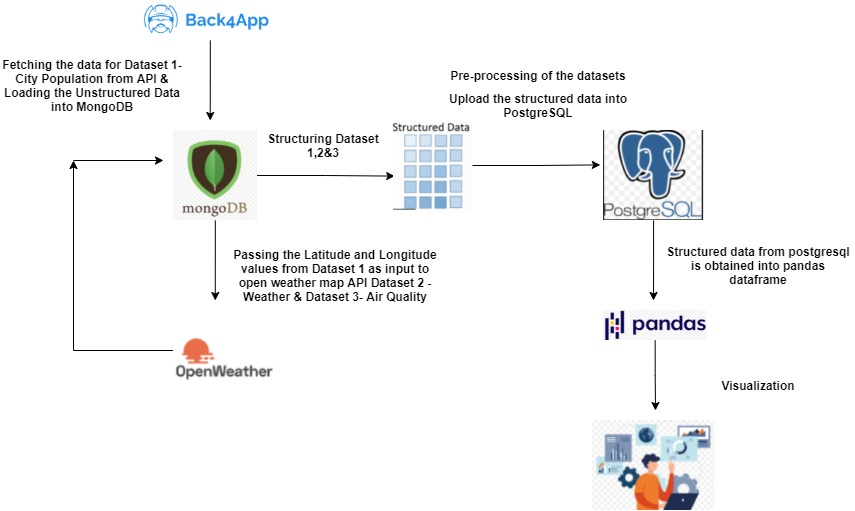
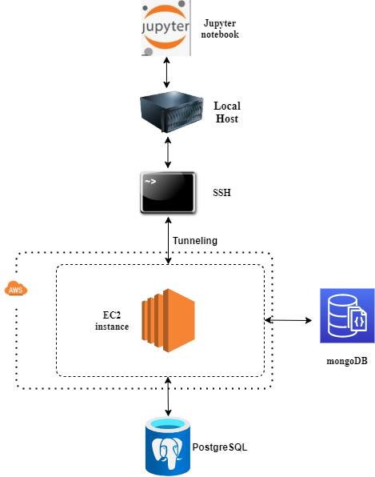

# Database and Analytics - ETL, Ingestion and Visualization
# Analysis Of Influence Of Weather And Population On Air Quality Of Cities

## Introduction

This project establishes a comprehensive overview on the type of connection that exists between the three main factors – weather, Air Quality Index and Population of a city. The analysis is done by integrating three different datasets obtained dynamically from APIs, performing ETL operations, data imputations, data ingestion and building visualizations on the resultant data.

### Dependencies

This project uses the following packages:

- `json`
- `urllib`
- `requests`
- `pymongo`
- `pandas`
- `psycopg2`
- `sqlalchemy`
- `tqdm`
- `matplotlib`
- `seaborn`
- `plotly`
- `pycountry`


##### Development installation

For a development installation (requires JupyterLab (version >= 3) and yarn):

```
$ git clone https://github.com/manojkumar-nci/DAP-Project---Team-E
$ cd DAP-Project---Team-E
$ pip install <libraries>
```

### Configuration

Run this command on the local command prompt/terminal to port forward all incoming requests on local port 9999 to the ec2 instance's mongodb server port listening on 27017
```
$ ssh -N -L 9999:localhost:27017 -i <sample.pub> ubuntu@ec2-108-128-209-156.eu-west-1.compute.amazonaws.com
```

Run this command on the local command prompt/terminal to port forward all incoming requests on local port 63333 to the ec2 instance's postgresql server port listening on 5432

```
$ ssh -N -L 63333:localhost:5432 -i <sample.pub> ubuntu@ec2-108-128-209-156.eu-west-1.compute.amazonaws.com
```

The **config.ipynb** contains all the properties such as the databaseName, ports, username, password, remote server ip addresses, etc... Change the property **privateKeyFilePath** in the config file to 
hardcode the name of the private key file that needs to be used for ssh tunneling to the database ports.

```
$ privateKeyFilePath = '<id_rsa>'
```

Run all the cells in the **master.ipynb** notebook to sequentially view the final output

### Steps followed in analysis

- `Extract city dataset (dataset 1) via api from back4app and load the data into mongodb`
- `Get latitude and longitude for each record in City dataset to fetch the relevant forecasted weather and forecasted air quality details from OpenWeather Map API and load it into mongodb`
- `Perform pre-processing, cleansing, transformation on City, Weather and Air Quality datasets and construct the final pandas dataframe`
- `Load the final structured dataframes into postgresql`
- `Perform aggregations on 5 days of forecasted data and load the resultant joined results into a table in postgresql`
- `Visualize the individual datasets and the final resultant joins for inferences and statistical findings`

### NOTE

OpenWeather API has constraints of only 1000 API calls per day, hence the initial extracted data for the City, Weather and Air Quality data is loaded into mongodb database hosted over an AWS EC2 instance server and all the rest of the process have been automated on a single run of the master.ipynb notebook file.

### Data Flow Diagram




### Cloud Architecture



